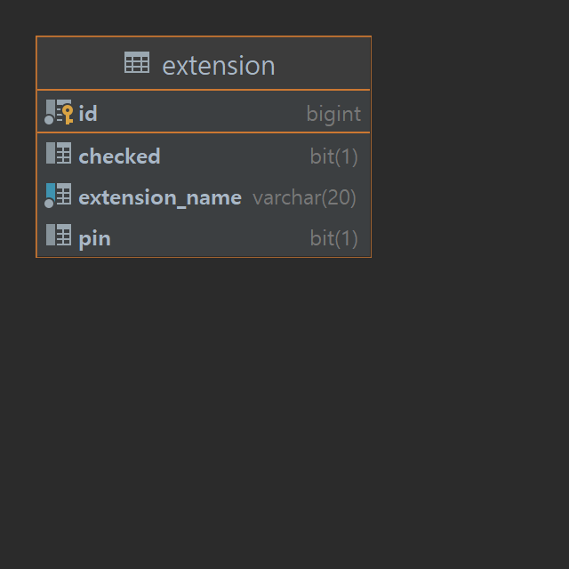

## 파일 확장자 차단
파일 확장자에 따라 특정 형식의 파일을 첨부하거나 전송하지 못하도록 제한

### 요건
- [ ] 고정 확장자는 차단을 자주하는 확장자 리스트
    - [x] unCheck 상태가 default 값
- [ ] check, uncheck 할 때마다 db에 저장
    - 새로고침시 유지
    - 커스텀 확장자는 check, uncheck가 없는 것에 유의

- [x] 확장자 최대 입력 20자
- [ ] 추가 버튼 클릭 시 db 저장 후 표현됨

- [ ] 커스텀 확장자 최대 200개까지 추가 가능
- [ ] 확장자 옆 x 클릭하여 삭제

### 고려 사항
- [x] 확장자명 유효성 처리
  - [x] 빈 문자열
  - [x] 띄어쓰기
  - [x] 영어
  - [x] 최대 길이
- [x] 유효성 검증에 따른 예외 처리 및 응답
- [x] 일부 잘못된 문자열 입력을 유효한 입력으로 가공
  - [x] 대문자 소문자로 변경
  - [x] 빈문자열 삭제
  
  
- [x] 커스텀 확장자 중복 체크
- [ ] 고정 확장자 개수 제한
- [ ] 차단 자주 되는 확장자 고정 확장자로 변경?

  
### ERD

